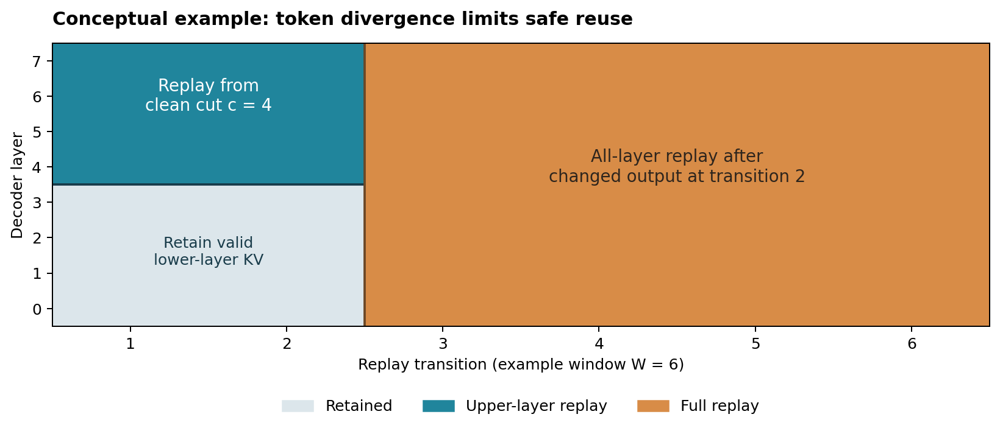
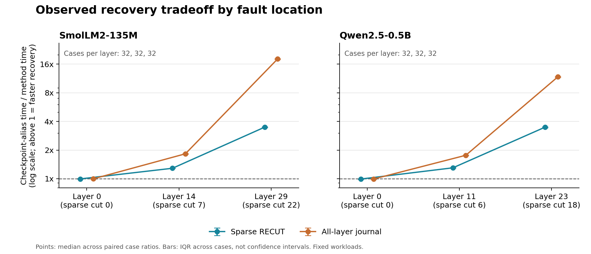

# RECUT: provenance-aware recovery of persistent LLM state

## Working paper and thesis decision brief

Prepared for Nazish Baliyan, 16 September 2026. For discussion with Prof. Abdulrahman Mahmoud. Authorship and submission require human review. This is a completed bounded pilot and a research proposal, not a completed thesis or an accepted/submission-ready paper. This final assessment supersedes the first two PDFs' prospective novelty/readiness recommendations.

## Abstract

A numerical error in an LLM's KV cache can influence later cache entries and generated tokens before it is detected. Restoring the original location alone need not restore the computation. We study a conservative recovery protocol that reuses saved hidden inputs below a known faulty layer only while the corrected token history still agrees with the speculative history. At the first changed output, it discards future state and regenerates from the embedding layer. The protocol assumes a trusted checkpoint, localized single-layer corruption and deterministic recovery. Primary localization is an oracle; a separate snapshot-difference check tests non-oracle localization for this restricted persistent-prefix fault family.

@@ABSTRACT_RESULTS@@

The findings support a narrow implementation result, not A/A*-level readiness. Activation-assisted KV reconstruction, delayed-error checkpointing and history-conditioned state reuse in self-speculative decoding are established. A late check of LayerSkip further narrowed the novelty claim. The proposed performance-thesis claim would need a distinct fault-specific result and a useful improvement over optimized adaptations with real verification and output-commit costs.

## Plain-language outcome

An LLM's working memory can contain the consequences of an earlier mistake even after the original mistake is fixed. RECUT asks which intermediate calculations are still safe to reuse. It repairs the affected later calculations, but starts over through all layers once a corrected word changes the subsequent input. This restores the model's own fault-free computation; it does not make the model's answers factually true or aligned.

## Decision for the professor

**Discuss as a conditional investigation; do not commit to it as an A/A*-targeted thesis yet.** The supervisor match is dependable AI execution, selective protection and fault analysis. The main unresolved issue is whether any fault-specific contribution is consequential rather than a straightforward composition of established ideas. The pilot is complete, but the requested high-impact publication goal is not established.

<!-- PAGE -->
# 2. Problem, importance and supervisor fit

## What existing repair can miss

The KV cache stores per-layer information from previously processed tokens. A finite error in an old entry may alter attention, later-layer inputs and future decisions. Some later cached values can be wrong even when the visible tokens have not changed. Conversely, a last-layer error can change the pending output without changing newly stored KV at that step. Both state and output must therefore be checked.

This distinction matters for persistent inference sessions, but the present study does not measure incident frequency in a production service. Cheap before-use integrity checks may be a better solution. A useful research result must establish when delayed recovery is needed and when its extra cost is justified.

The figure is conceptual, not a measured trial: after the second repaired decision changes, every later step uses full-layer replay. Before that boundary, the lower-layer state can remain valid under the stated fault model.

## Why it matches Mahmoud's background

The official MBZUAI profile describes reliable, high-performance AI systems, including hardware faults and software errors. His publication list connects application-visible fault effects, selective protection and numerical formats: GoldenEye (DSN 2022), selective CNN protection (ISSRE 2021), Minotaur (ASPLOS 2019) and related resilience work. RECUT is a direct methodological fit to that dependable-execution line. It is not evidence of his endorsement or of an unpublished research agenda. [Official profile](https://mbzuai.ac.ae/academics/faculty-directory/abdulrahman-mahmoud); [publications](https://ma3mool.github.io/publications/).

The project is about numerical execution reliability, not a general solution to deception, jailbreaks or alignment. The AI-safety websites informed evaluation standards and discovery of nearby work; they do not make this automatically an alignment contribution.

<!-- PAGE -->
# 3. Literature review and novelty boundary

## Review coverage

All 100 supplied PDFs have a per-paper review entry and a matching nonempty extracted text. The collection has 1,767 physical-page markers. Eighteen selected papers received deeper focused review; 82 received selected-section screening. This is not 100 exhaustive cover-to-cover reads or independent reproduction of their results. The readable 100-paper ledger and three source ledgers accompany this draft.

All 30 requested websites were checked, with SPAR and MATS as two extra resources. The access audit distinguishes readable project pages, navigation-only results, unavailable rosters and failed links. Program inclusion is neither technical evidence nor institutional endorsement. Two supplied records, 036 and 039, have unresolved identifier/date inconsistencies; neither is essential to this study's central claim.

| Closest work | What must not be claimed as new | What this pilot actually adds |
| --- | --- | --- |
| HCache; HybridServe; KVPR | Exact KV reconstruction from activations and storage/recomputation tradeoffs. | An executable delayed-corruption recovery contract with a token-divergence boundary; no superiority over their full implementations is established. |
| LayerSkip; VeriCache | History-conditioned verification and rollback, including layer-state reuse or lossy-KV drafts. | A localized numerical-fault/checkpoint contract, not a new general state-reuse or exact-output correction principle. |
| Classical delayed-SDC checkpointing | Verification delay, retaining clean checkpoints and checkpoint-period optimization. | A transformer layer/token instantiation, not a new checkpointing principle. |
| vLLM valid-prefix recovery RFC | Selective rollback of affected requests to a valid prefix. | Comparison against a full suffix-replay implementation with the same trusted checkpoint. |
| Shared-KV fault study; Models Take Notes | Persistence, propagation and stale derived cache information. | State/logit/token controls and exact recovery within the stated numerical path; not first discovery of the phenomenon. |
| GhostServe; Concordia | KV redundancy, partial recomputation, snapshots and logs; GhostServe's accessed discussion includes soft memory errors. | Controlled delayed trajectory-repair tests, not an implementation or demonstrated improvement over those systems. |

<!-- PAGE -->
# 3. Updated novelty assessment (continued)

The remaining candidate contribution in this study is a fault-specific recovery contract and a consequential, measured systems result. The general token-history validity rule is not a sufficient novelty claim: LayerSkip already combines activation/KV reuse with acceptance of a matching prefix and rollback at disagreement. It does not study this delayed numerical-fault contract, but it substantially strengthens the incremental-composition objection. The first two PDFs preserve the earlier prospective assessment; this late finding narrows it rather than being silently omitted. [LayerSkip, sections 4.3 and Appendix A.4](https://arxiv.org/html/2404.16710v1).

The acronym, activation journals, output buffering, a checksum and error propagation are not new contributions. The correctness argument is a standard induction, not a demonstrated optimality theorem.

VeriCache also checks compressed-KV drafts against full KV and corrects the first disagreement. Exact-output correction after altered KV is therefore not an empty prior-art category. The final six-record falsification note separates each accessed method from this pilot's narrower fault contract. [VeriCache, section 4.1](https://arxiv.org/html/2605.17613v1).

The strongest skeptical objection remains valid: this may be an obvious application of checkpointing to a known dependency graph. No accessed source was found to establish this exact tested combination, but a search cannot prove priority. The pilot justifies further falsification, not a statement that the idea is already high-impact or publication-ready.

<!-- PAGE -->
# 4. Recovery contract and algorithm

Let N be the number of layers, indexed 0 to N-1. A clean prefix has T processed tokens. A perturbation affects existing KV at layer L immediately after a trusted checkpoint. The next input token was selected before the fault. The model then executes W uncommitted transitions. A journal cut c is the hidden input immediately before layer c, not its output.

## Required assumptions

Fixed weights; evaluation mode; one unpadded sequence; ordinary append-only, layer-local unquantized KV; default rotary positions; fixed eager single-token arithmetic; deterministic greedy decisions; and trusted checkpoint, journal payloads, localization and recovery computation. No sampling, concurrent batching, recurrent/hybrid state or real external action is included.

The first pilot has oracle localization and a known clean time boundary. Metadata checks do not certify a journal's integrity. A corrupt checkpoint or incorrectly reported layer can invalidate the guarantee. Unsupported cases are rejected; this is not an operational safety controller.

## Procedure

1. Keep W decisions private. Save hidden inputs at selected cuts, with position, input token and engine identity. Preserve a trusted prefix checkpoint available to every valid method.

2. Choose the deepest saved c <= L; c=0 uses ordinary full-layer replay. Restore the checkpoint in the layers to be replayed. Skipped lower layers may retain a speculative suffix only while the input histories agree.

3. Replay each transition from its clean journal input. If the corrected output first differs at one-based transition j, crop every layer to exactly T+j processed tokens and permanently disable old journals. Transition j itself is still cut-replayable; transition j+1 must use the corrected token from the embedding layer.

4. Do not re-enable journals if token streams later reconverge. At the final transition, keep the corrected pending output even though it is not yet represented in KV. The experiment validates the complete state and a two-step continuation against a separate clean run outside the recovery timer.

## Conditional correctness and work

For c <= L, lower layers cannot read the faulty higher-layer KV except through future token choices. While histories agree, their states and the saved layer-c input remain clean. Replaying the upper region from the clean prefix therefore reconstructs its outputs by induction. At divergence, cropping establishes a completely clean frontier; ordinary decoding reconstructs the remaining suffix.

With j=infinity when outputs never diverge and k=min(j,W), executed layer-token work is Q = N W - c k. This is a count of work, not a wall-time prediction or proof of minimal repair. Byte-identical execution is not claimed: checks use exact elementwise tensor equality under fixed arithmetic, which does not distinguish signed zero.

<!-- PAGE -->
# 5. Implementation and experimental protocol

## Executed scope

@@ENVIRONMENT@@

The implementation calls the installed Hugging Face decoder layers, attention-mask helper, rotary module and output head. It does not hand-reimplement attention math. Every native-parity gate checks both logits and complete KV against the library's full incremental forward. The primary gate spans 128 prefix positions plus 14 further steps per model, covering the maximum W=12 window and two-step continuation.

## Frozen matrix

Four constructed prompts cover prose, arithmetic, structured records and code-like text. Tokenized inputs are repeated/truncated to exactly 64 or 128 tokens; these are controlled mechanism workloads, not a standard task-quality benchmark. The same prompt may appear in multiple trials, so repeated cases do not establish broad language-task generalization.

Per model: 4 prompts x 3 layer fractions x 2 windows x 2 cache kinds x 2 perturbation shapes = 96 perturbed cases, plus 12 no-op controls. Layers are floor(fraction x (N-1)) for fractions 0, 0.5 and 1. Windows are 4 and 12 transitions. K and V are both tested. Separate debug prompts/seeds are excluded from primary counts.

For each perturbed case, a seeded CPU generator chooses a prefix token, head and coordinate without searching model outputs. A scalar or complete head vector receives Gaussian additive noise scaled by eight times that layer tensor's RMS, then rounds to BF16. These stress perturbations are synthetic; they do not estimate physical bit-flip distributions or field fault rates. Before/after values and actual changed-element counts are recorded.

## Methods and measurement

No recovery and original-slot restoration are negative controls. Full suffix replay is the main valid baseline. Sparse RECUT journals at floor(N/4), floor(N/2) and floor(3N/4); the all-layer baseline journals every nonzero cut and chooses c=L. It is an adaptation of activation-assisted recovery, not a reproduction of HCache or HybridServe.

Each valid method has one excluded warmup and three counterbalanced timing repetitions. Restoration and replay are timed with GPU synchronization; common preparation of the working cache and experimental correctness diagnostics are excluded equally. Fault-free overhead uses actual no-journal/sparse/all-layer acquisition, with warmup and five rotated repetitions. Snapshot copy times, payload bytes and fixture-inclusive peak allocations are retained separately.

<!-- PAGE -->
# 6. Correctness results

@@CORRECTNESS_TABLE@@

@@CORRECTNESS_INTERPRETATION@@

<!-- PAGE -->
# 6. Correctness evidence (continued)

## Checks beyond matching the generated words

Every valid repair is compared on all K/V tensors, shapes, dtypes, finiteness, logical cache counters, W output decisions and final logits. A two-step continuation checks subsequent tokens, cache and logits. The final predicted token is explicitly treated as pending, not already cached. Per-repetition traces verify the layer-work identity; primary branch coverage is qualified below.

@@BOUNDARY_RESULTS@@

@@AUDIT_RESULTS@@

## What zero observed failures means

It establishes success on these recorded deterministic scenarios. It does not prove zero failure probability for other prompts, fault families, models, precision paths or deployments. Timing repetitions and three methods on the same injected state are not additional independent fault trials. Even a textbook zero-failure binomial bound would require an IID sampling claim that this constructed workload does not provide.

The clean reference is an experimental oracle sharing the model's underlying operations. Native-library parity and analytic counterexamples reduce shared-implementation risk, but this is not machine-checked verification or external replication. The distinct audit program checks evidence consistency and stored snapshots; it is not an independent laboratory rerun.

<!-- PAGE -->
# 7. Recovery cost, normal cost and memory

@@PERFORMANCE_TABLE@@

@@PERFORMANCE_INTERPRETATION@@

@@MEMORY_TABLE@@

The payload figures exclude Python metadata, allocator fragmentation and protection of trusted state. Raw peak allocations include resident reference/faulty/checkpoint fixtures, so they must not be presented as the memory of a standalone serving deployment. Both models use grouped-query attention; a hidden activation is not universally half the size of that layer's KV.

## Break-even is not an observed fault rate

If H is the added journal cost per window and S is saved recovery time per incident, a simple single-incident expected-time model needs p > H/S when both are positive. The experiment estimates costs for its artificial case mix, not p. Verification and checkpoint costs common to the compared recovery methods cancel only within that restricted comparison; they still matter to a deployment. Private-window latency is a separate application cost.

@@BREAK_EVEN@@

Any negative measured overhead is timing noise or an unresolved implementation effect, not proof that storing journals is free. Recovery speedup is not service-throughput speedup. The custom eager decoder is a correctness-oriented reference, not an optimized vLLM/FlashAttention baseline.

<!-- PAGE -->
# 8. Stronger-baseline sensitivity

An independent implementation review found a potentially avoidable cost in the conservative full-replay baseline: restoring every prefix layer by copying checkpoint tensors. Because the contract gives a single known faulty layer, a stronger baseline can truncate all suffixes with views, restore only that layer's complete K/V prefix, and still replay every layer normally. It does not need the exact corrupted coordinate.

An even simpler baseline starts a fresh cache by aliasing the same trusted resident-GPU checkpoint, avoiding all prefix copies. Appends allocate new tensors. The implementation checks that checkpoint and original fault-state payloads remain unchanged. The alias baseline needs no fault-coordinate information. These views retain backing allocations; no physical memory release is implied.

This extension was specified while the frozen primary run was in progress, without changing that run. It repeats all 192 perturbed primary model/case pairs, not a selected favorable subset. Five rotated timing repetitions and a warmup compare conservative full replay, view/one-layer restore, checkpoint-alias replay, sparse RECUT and all-layer RECUT. These reused scenarios are not 192 additional independent faults. The supplementary run is explicitly post-hoc baseline sensitivity.

@@SUPPLEMENTAL@@

Only within-supplement paired comparisons support conclusions about this implementation change. Comparing times from separate GPU runs would mix restoration changes with system variability. The optimized full baseline is still an eager, batch-one reference; it is not a production serving baseline. Sparse and all-layer methods retain their original restoration code, making this a stronger challenge to them rather than a joint optimization of all methods.

<!-- PAGE -->
# 9. Where the recovery gain comes from

This figure uses only the separately audited supplemental run. Each point summarizes all cases at that tested layer; the same four prompts and two windows recur, so these are descriptive strata rather than independent workload samples. Error bars show interquartile ranges, not statistical confidence. No primary timing samples are mixed into the figure.

At the first layer, no lower-layer work can be skipped. Later clean cuts can avoid more work until a token decision changes. The all-layer method chooses cut L, whereas the sparse policy chooses the deepest configured cut no greater than L. The measured ratios include the policies' restoration and bookkeeping, not only decoder-layer invocations.

The sparse cuts were fixed independently of outcomes at floor(N/4), floor(N/2) and floor(3N/4). The tested middle fault is floor((N-1)/2), just below the middle cut, so it selects the quarter-layer cut. Consequently the middle configured journal is not selected by these three tested fault locations, although its collection cost is paid. No placement tuning was performed after observing results. These measurements do not establish the best cut placement or a globally optimal storage/recovery frontier.

Late-layer benefits must not be generalized to a workload dominated by early errors or early token divergence. No real fault-location distribution was measured. The formula Q = N W - c min(j,W) describes the supported implementation's work; it does not make the balanced test mixture a deployment model.

<!-- PAGE -->
# 10. Restricted detection feasibility

The existing trusted checkpoint makes a simple comparison possible. Old prefix entries are immutable under the supported append-only decoder. At the end of the window, the detector compares those entries with the checkpoint, reduces mismatches per layer on the GPU, and transfers the resulting layer flags to the host. Its input does not include the injected layer or coordinate. A unique changed layer routes supplemental repair; no difference falls back conservatively, and multiple changed layers are outside this pilot's recovery contract.

This is ordinary snapshot-difference detection, not a new error-detection invention. It was added as a separate post-hoc check before supplemental measurements. The original primary run still uses oracle localization. All 216 primary model/case pairs are reused for detection, including 24 no-op controls; the supplemental recovery timing matrix contains only the 192 perturbed pairs.

@@DETECTOR_RESULTS@@

## Why coverage remains narrow

The comparison scans the old prefix, not the newly generated suffix. It cannot detect suffix-only corruption, compute-only errors that leave the compared prefix unchanged, a transient error restored before checking, weight or journal errors, a bad checkpoint, or matching damage to both copies. Unit controls deliberately expose suffix-only and restored-transient blind spots. No-op false alarms and detection of this injected family are not population error rates.

The full snapshot must still be stored, updated and protected. Logical payload reads are not measured HBM traffic; allocations, synchronization and long-context scaling also matter. Detection is measured outside the recovery timer and is common to the compared repair choices. The study has no network commit protocol, live clients or proof that all committed computation is fault free. In particular, checking only a prefix cannot certify that a newly created checkpoint is clean.

<!-- PAGE -->
# 11. Validity limits and publication assessment

## Limits that cannot be hidden by a good plot

**Detection and trust:** primary localization is supplied by the injection harness. Supplemental snapshot comparison localizes only the persistent old-prefix faults covered by its contract. There is no measured general fault detector, population false-negative rate, uncertain-localization recovery or trusted-storage failure model. Errors before the checkpoint, faults in model weights or journals, multiple-layer faults and faults during repair are outside scope.

**Fault realism:** finite source-level tensor perturbations are not physical fault induction or validated instruction-level error profiles. No NVBit or GPU binary instrumentation was used; lab permission for that remains unresolved. No security exploit or external target was exercised.

**Scale and serving:** two compact models, short contexts, one GPU, batch size one, eager attention and four constructed prompts are insufficient for production or broad quality claims. The Qwen library emitted an eager/sliding-window warning; its configuration disables sliding-window use, contexts remain short, and native numerical parity is checked. No general sliding-window support is claimed.

**Branch coverage:** only two of 192 primary perturbations changed greedy tokens within the W-step window, both at its last step. The separately selected two-token extension probes one observed boundary; it cannot establish general recovery behavior after long or diverse token divergences.

**Baselines:** the supplement measures two copy-avoiding full-replay variants. Further fused recovery, jointly optimized journal repair, production batching, before-use verification and published systems' full implementations may change the frontier. The all-layer baseline is a strong comparator within this replay family, not a universal optimum.

**Commitment:** buffer ownership is modeled by private Python data, not a network service with real clients. Already-emitted wrong text or external actions cannot be undone by repairing KV. The study measures window computation cost, not a production output-commit SLO.

<!-- PAGE -->
# 11. Publication assessment (continued)

## Present decision

@@DECISION@@

DSN and ISSRE are A-ranked in ICORE2026; ASPLOS is A*. The topic is closest to dependable computing. ASPLOS requires a substantive architecture/OS/PL advance, not simply running an LLM on a GPU. Rank and topical fit are not acceptance predictions. [DSN rank](https://portal.core.edu.au/conf-ranks/?by=all&page=1&search=DSN&sort=atitle&source=all), [ISSRE rank](https://portal.core.edu.au/conf-ranks/1411/), [ASPLOS rank](https://portal.core.edu.au/conf-ranks/147/), [ASPLOS scope](https://www.asplos-conference.org/asplos2027/cfp/).

The official DSN 2027 call lists abstracts on 25 November 2026 and papers on 2 December 2026, AoE. That is a planning opportunity, not a promise this work can meet the standard or deadline. Recheck the selected track with the professor. [Official call](https://dsn2027-berlin.github.io/call-for-contributions/).

<!-- PAGE -->
# 12. Thesis roadmap and professor discussion

## Three decision gates, in order

1. **Defeat the closest adapted baseline.** Compare optimized valid-prefix replay, activation restoration and self-speculative state-reuse principles adapted to the same fault contract and equal byte/commitment budgets. Include simpler verification before use. Establish a non-dominated operating region and a distinct fault-specific contribution or stop the performance-thesis claim. The work-count identity alone is not the contribution.

2. **Extend beyond snapshot-only localization.** Specify a realizable detector with an explicit trusted computing base and verification window for the actual target fault family. Charge read/write cost, snapshot validation, false alarms, misses, localization granularity and fallback. Test uncertain locations, suffix/compute-origin errors and out-of-window events. The simple prefix comparison is a feasibility control, not a solution to these requirements.

3. **Validate the surviving case in real serving.** Use a larger supported model, longer contexts and an actual task corpus in an optimized single-GPU path before attempting distributed scale. Preserve exact numerical controls, measure normal throughput and recovery tails, and expand fault families with a justified mapping to real error mechanisms. Architecture-level instrumentation requires lab authorization.

These are proposed extensions, not experiments already performed. The first gate should be an early stop/go test; adding more models without resolving novelty and detector economics is not sufficient.

## Suggested opening in the meeting

"I screened the supplied 100-paper corpus and additional work. Activation-based KV restoration, checkpointing and history-conditioned reuse already exist, so I am not claiming those as new. I built a bounded delayed-fault recovery study, checking full state and output rather than plausible answers. The implementation works in its tested scope, but a late LayerSkip comparison weakens the novelty case. I would like your judgment on what distinct fault-specific result could justify continuing, or whether this direction should be rejected as too incremental."

## Decisions to obtain from the professor

Agree on the target fault/detection model, the strongest competing implementation, acceptable output holdback, and the minimum result that justifies a full thesis investment. Ask what additional mathematical or architecture contribution is expected by the degree and intended venue. Discuss access to realistic error traces or authorized fault-analysis tools; do not infer permission from possessing HPC credentials.

## When to reject or redirect

Reject the claimed advantage if it depends on unavailable oracle information, omitted steady-state cost, selected late-layer faults only, or unacceptable buffering. A negative-result paper would need a general, novel explanation of a failure boundary, not just an unsuccessful prototype. No research direction is "perfect" before those questions are answered.

<!-- PAGE -->
# 13. Artifact, reproducibility and disclosure

@@ARTIFACT@@

The supporting package includes the source and pinned environment, immutable model revisions, frozen configs, raw JSONL episodes, native-parity traces, timing repetitions, selected complete-state snapshots, descriptive summary, separate audit, post-hoc boundary diagnostic, 100-paper review, website audits, proof sketch and all three PDFs. It excludes model weights, Python environments, SSH sockets and credentials. Earlier RAVEN/ProofOps results were not changed or reused as RECUT evidence.

The SSH connection used the supplied authorization. Computation and installations ran only within Slurm allocations. One initial setup failed because system Python lacked venv support; a user-space environment resolved it. Failed logs remain included. The scheduler accounting service was unavailable, so the record does not invent a sacct exit status. No AWS cluster changes, public deployments, external messages or conference submissions occurred.

## AI assistance and responsibility

Literature screening, code, tests, analysis and this draft were produced with AI assistance, including separate-agent reviews. Those reviews are not human peer review or external replication. Nazish and the supervisor must verify references, scientific claims, authorship, institutional AI-use rules and the final manuscript before submission. This draft does not list the professor as a coauthor without agreement.

<!-- PAGE -->
# 13. Selected primary references (continued)

1. [HCache](https://arxiv.org/abs/2410.05004), EuroSys 2025 author record; activation-assisted state restoration.

2. [HybridServe](https://arxiv.org/abs/2501.01792), ICCD 2025 author record; hybrid activation/KV caching.

3. [KVPR](https://arxiv.org/abs/2411.17089), 2025 revision; partial KV recomputation.

4. [Aupy et al., silent-error detection and checkpointing](https://arxiv.org/abs/1310.8486), PRDC 2013 author record. A later date printed in the fetched PDF is not treated as a new publication date.

5. [vLLM KV-load failure RFC](https://github.com/vllm-project/vllm/issues/19329), engineering proposal; not a peer-reviewed result or implementation verification.

6. [Shared-KV bit-flip study](https://arxiv.org/abs/2604.17249), 2026 author record; defensive high-level comparison only.

7. [Models Take Notes at Prefill](https://arxiv.org/abs/2606.17107) and [Stage-Replay Divergence](https://arxiv.org/abs/2607.28495), 2026 preprints.

8. [Aborted but Not Forgotten](https://arxiv.org/abs/2608.15939), 2026 preprint; rollback-consistency contract, no exploit reproduced.

9. [GhostServe](https://proceedings.mlsys.org/paper_files/paper/2026/hash/d99e8e80a6c41e148db686918dd7eab3-Abstract-Conference.html), MLSys 2026 publisher record; KV redundancy and partial recomputation. Its [accessed author version](https://arxiv.org/html/2605.00831v1) discusses soft memory errors. [Concordia](https://arxiv.org/abs/2606.23521), 2026 preprint; GPU checkpoint/log recovery.

10. [SmolLM2-135M](https://huggingface.co/HuggingFaceTB/SmolLM2-135M) and [Qwen2.5-0.5B](https://huggingface.co/Qwen/Qwen2.5-0.5B), official public model cards. Exact revisions are in the artifact.

11. [LayerSkip: Enabling Early Exit Inference and Self-Speculative Decoding](https://aclanthology.org/2024.acl-long.681/), ACL 2024 publisher record; author-text sections 4.3 and Appendix A.4 are a direct mechanism-level novelty constraint, discovered in the final falsification pass.

12. [VeriCache: Turning Lossy KV Cache into Lossless LLM Inference](https://arxiv.org/abs/2605.17613), 2026 preprint; section 4.1 constrains any broad exact-output recovery claim. Reported performance was not independently reproduced.
